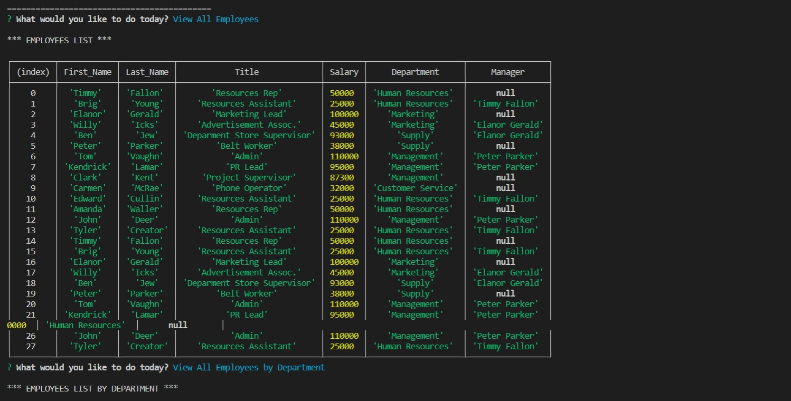

# Employee Tracker

## Screenshot:

## USAGE:

- This application allows you to create a dynamic, extensive database for your employees, departments, and roles.

## Installation

In order to use this application, you must first clone all files. Then, use 'npm i' to install all neccessary packages. After, just run 'npm start' and the application will give you a full run through.

## Technology learnt/used

- SQL, inquirer
